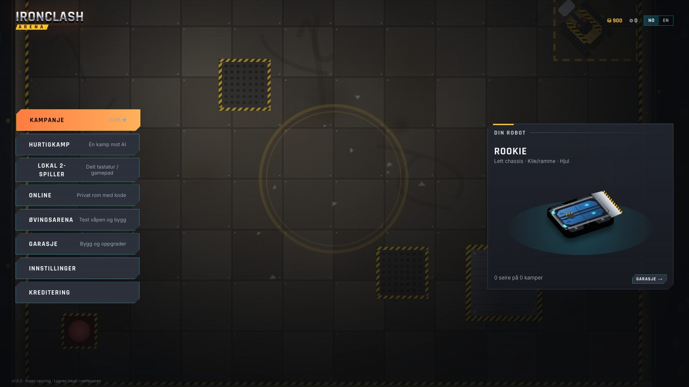
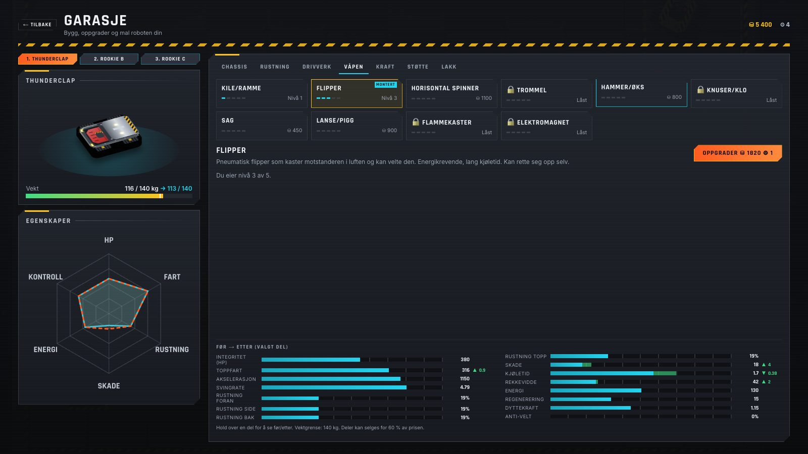
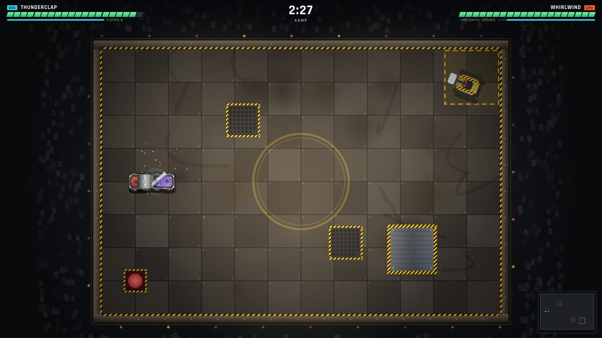
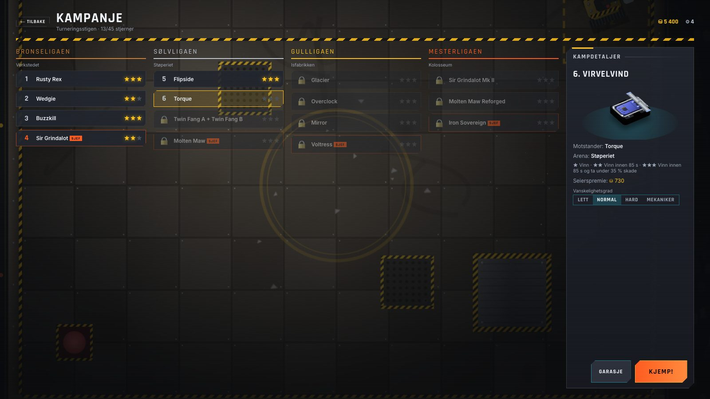
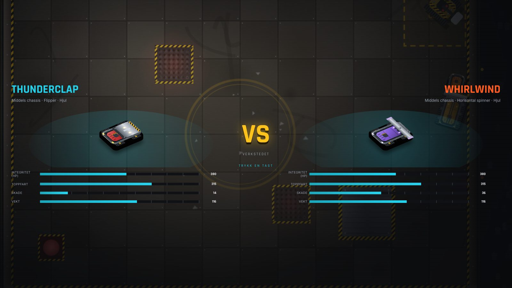

# IRONCLASH ARENA

**Bygg, oppgrader og knus.** IRONCLASH ARENA er et 2.5D robotkampspill for nettleseren. Du bygger din egen kamprobot i garasjen, kjemper deg gjennom en turneringsstige med fire ligaer, møter vennene dine på samme tastatur eller online – og prøver å holde deg unna gropen, flammestrålene og husrobotene.

> Inspirert av klassiske robotkamp-TV-programmer, men alt innhold – navn, roboter, arenaer, grafikk og lyd – er originalt og laget prosedyrisk i koden.



| Garasje                                    | Kamp                                |
| ------------------------------------------ | ----------------------------------- |
|     |  |
| **Kampanjekart**                           | **VS-skjerm**                       |
|  |       |

## Funksjoner

- **Kampanje** med 15 nivåer i 4 ligaer (Bronse, Sølv, Gull, Mester), sjefskamper, stjerner (1–3), interaktiv tutorial og programleder-kommentarer.
- **10 våpentyper** med egen fysikk og telegrafering: kile, flipper, horisontal spinner, trommel, hammer, knuser/klo, sag, lanse, flammekaster og elektromagnet.
- **Skademodell** med retningsbasert skade (bak og sider gjør mer vondt), komponentskade (drivverk/våpen), velting, selvretting, immobilisering (10 s nedtelling), «The Pit» og dommerpoeng.
- **5 arenaer** med unike utfordringer: Verkstedet (spikere), Støperiet (flammestråler og smeltet metall), Isfabrikken (is, dreieskive, presse), Kolosseum (alt på en gang) og bonusarenaen Skraphaugen (løse objekter).
- **Husroboter** som vokter hjørnesonene (CPZ).
- **Garasje** med 5 oppgraderingskategorier × 5 nivåer og flere varianter, vektgrense, før/etter-sammenligning med radardiagram, 3 robotoppsett, salg for 60 %, maling, dekaler og navn. Oppgraderinger synes på roboten.
- **Økonomi** med credits og skrapdeler, stilbonuser, valgfri reparasjonskostnad (hardcore) og fire vanskelighetsgrader (Lett, Normal, Hard, Mekaniker).
- **Utility-AI** med personligheter, reaksjonstid, menneskelige feil, flanking, farekart + flowfield-navigasjon og «lokk inn i felle». `?debug=ai` viser AI-ens tanker.
- **Lokal 2-spiller** (delt tastatur og/eller gamepads) med rettferdig modus.
- **Online flerspiller** via WebRTC (PeerJS): privat rom med 6-tegns kode og delbar lenke, vertsautoritativ simulering, klientprediksjon og interpolering, ping og håndtering av frakobling.
- **Øvingsarena** med uendelig-HP-dukke og skadetall.
- **Prosedyrisk lyd og musikk** (Web Audio) med egne volumkanaler.
- **Norsk og engelsk**, tastatur- og gamepad-navigasjon i alle menyer, fargeblind-modi, tekststørrelse, redusert bevegelse.
- **PWA** – kan installeres og spilles offline (singleplayer). Lagring i nettleseren med eksport/import.

## Kontroller

| Handling              | Spiller 1     | Spiller 2   | Gamepad                      |
| --------------------- | ------------- | ----------- | ---------------------------- |
| Kjør frem/bak         | W / S         | ↑ / ↓       | Venstre spak / D-pad / RT-LT |
| Sving                 | A / D         | ← / →       | Venstre spak / D-pad         |
| Våpen                 | Space         | Enter       | A eller RB                   |
| Spesial (støttemodul) | Venstre Shift | Høyre Ctrl  | B eller LB                   |
| Turbo                 | E             | Høyre Shift | X                            |
| Pause                 | Esc / P       | Esc / P     | Start                        |

Når roboten er veltet: hold **våpen** eller **spesial** for å rette den opp (flippere og hammere gjør det raskt, selvrettingsmodulen enda raskere). Alle taster kan endres under _Innstillinger → Kontroller_. Gamepads tildeles automatisk (én gamepad i 2-spiller går til spiller 2).

## Kom i gang

Krever Node.js 20 eller nyere.

```bash
npm install
npm run dev          # utviklingsserver på http://localhost:5173
```

| Kommando                          | Hva den gjør                                                                                  |
| --------------------------------- | --------------------------------------------------------------------------------------------- |
| `npm run dev`                     | Utviklingsserver med hot reload                                                               |
| `npm run build`                   | Typesjekk og statisk produksjonsbygg i `dist/`                                                |
| `npm run preview`                 | Server `dist/` lokalt                                                                         |
| `npm test`                        | Enhetstester (Vitest)                                                                         |
| `npm run test:coverage`           | Enhetstester med dekning (krav: > 70 % i `core/` og `net/protocol`)                           |
| `npm run test:e2e`                | Playwright-røyktester (bygger og starter preview selv)                                        |
| `npm run lint` / `npm run format` | ESLint / Prettier                                                                             |
| `npm run sim`                     | Balansesimulering: tusenvis av AI-mot-AI-kamper (`--matches 40`, `--only weapons`, `--write`) |
| `npm run assets`                  | Genererer PWA-ikoner, favicon og delingsbilde (krever kjørende dev-server)                    |

Tips: Har du Google Chrome installert, men ikke Playwrights egen Chromium, kan du kjøre `PW_CHANNEL=chrome npm run test:e2e`.

## Publisering

### GitHub Pages (standard)

`.github/workflows/deploy.yml` kjører lint, typesjekk, enhetstester med dekning og Playwright på hver PR. Ved push til `main` bygges spillet med riktig `base` (`/<repo-navn>/`) og publiseres til GitHub Pages.

1. Push repoet til GitHub.
2. _Settings → Pages → Build and deployment → Source: GitHub Actions_.
3. (Valgfritt) Legg inn variabler under _Settings → Secrets and variables → Actions_ (se miljøvariabler under).

### Netlify, Vercel og Cloudflare Pages

- **Netlify:** `netlify.toml` ligger klar. Koble til repoet – ferdig.
- **Vercel:** Framework «Vite», build command `npm run build`, output `dist`, miljøvariabel `VITE_BASE=/`.
- **Cloudflare Pages:** Build command `npm run build`, output `dist`, miljøvariabel `VITE_BASE=/` og `NODE_VERSION=22`.

Bygget er rent statisk, så det fungerer på enhver statisk webhost. `VITE_BASE` styrer stien (standard `./`, som fungerer i de fleste undermapper).

### Miljøvariabler

Se `.env.example`.

| Variabel                                                                 | Beskrivelse                                                          |
| ------------------------------------------------------------------------ | -------------------------------------------------------------------- |
| `VITE_BASE`                                                              | Base-sti for bygget (`/` på eget domene, `/<repo>/` på GitHub Pages) |
| `VITE_PEER_HOST`, `VITE_PEER_PORT`, `VITE_PEER_PATH`, `VITE_PEER_SECURE` | Egen PeerJS-signalserver. Tom = PeerJS sin gratis sky-server         |
| `VITE_TURN_URL`, `VITE_TURN_USER`, `VITE_TURN_CREDENTIAL`                | Valgfri TURN-server for spillere bak strenge NAT/brannmurer          |

### Egen PeerJS-server og TURN

PeerJS-skyen er grei for testing, men for et publisert spill anbefales egen signalserver:

```bash
npx peer --port 9000 --path /ironclash      # eller docker run -p 9000:9000 peerjs/peerjs-server
```

Sett `VITE_PEER_HOST=din.server.no`, `VITE_PEER_PORT=443`, `VITE_PEER_PATH=/ironclash` og bygg på nytt.

De fleste tilkoblinger går direkte (STUN). Noen nettverk (mobilnett, bedrifter) krever en TURN-relé, for eksempel [coturn](https://github.com/coturn/coturn):

```bash
docker run -d --network=host coturn/coturn -n --realm=ironclash \
  --listening-port=3478 --user=ironclash:hemmelig --lt-cred-mech
```

Sett `VITE_TURN_URL=turn:din.server.no:3478`, `VITE_TURN_USER=ironclash` og `VITE_TURN_CREDENTIAL=hemmelig`.

## Prosjektstruktur

```
src/
├─ config/        ALT innhold: våpen, deler, chassis, arenaer, kampanje, AI-profiler, økonomi, balanse
├─ core/          Motoruavhengig spillogikk (kjører headless i tester og simulering)
│  ├─ ai/         Utility-AI, farekart, flowfield, styring
│  ├─ combat/     Drivverk, skade, kollisjoner, våpen, støttemoduler
│  ├─ entities/   Robot, feller (hazards), husroboter
│  ├─ match/      MatchSim (60 Hz), dommere, WorldState-snapshots
│  ├─ economy/    Butikk, belønninger
│  ├─ campaign/   Progresjon
│  └─ save/       Zod-skjema, migreringer, lagring
├─ game/          Phaser-laget: scener, prosedyrisk grafikk, effekter, input
├─ net/           NetTransport, PeerJS, binær protokoll, vert/gjest, prediksjon
├─ audio/         Lydmanager, prosedyriske lydeffekter og musikk
├─ ui/            Preact-skjermer, komponenter og tema (design-tokens)
├─ state/         Delt app-tilstand og handlinger (bro mellom UI og Phaser)
└─ i18n/          no.json / en.json (genereres fra scripts/i18n)
tests/unit        Vitest   ·   tests/e2e  Playwright   ·   scripts/  sim, ikoner, i18n
docs/             ARCHITECTURE, DECISIONS, BALANCE, NETCODE, BACKLOG, SIM_RESULTS
```

Mer om lagdelingen i [docs/ARCHITECTURE.md](docs/ARCHITECTURE.md).

## Utvide spillet (alt er datadrevet)

### Nytt våpen

1. Legg typen til i `WeaponType` i `src/config/types.ts`.
2. Legg til en `WeaponSpec` i `WEAPONS` (`src/config/weapons.ts`): modus (`press`/`hold`), wind-up (telegrafering), bue, knockback, vekt, pris, basis- og vekstverdier. Delnivåene genereres automatisk.
3. Hvis våpenet trenger ny oppførsel: legg til en `case` i `strike()` (trykkvåpen) eller i hold-grenen i `src/core/combat/weapons.ts`.
4. Tegn det i `paintWeapon()` (`src/game/render/paint/weaponArt.ts`) og legg til animasjon i `RobotSpriteView.animateWeapon()`.
5. Legg til trusselnivå i `WEAPON_THREAT` (`src/core/ai/utility.ts`) og ev. i `RAM_WEAPONS` (`src/core/ai/plans.ts`).
6. Navn/beskrivelse i `scripts/i18n/strings_c.py` → `python3 scripts/i18n/build.py`.
7. Legg kilden til i `SOURCES` i `src/net/netEvents.ts` og øk `PROTOCOL_VERSION`.
8. Kjør `npm run sim -- --only weapons` og juster til ingen våpen har over 60 % vinnerrate.

### Ny arena

1. Lag `src/config/arenas/<id>.ts` med størrelse, tema, groper, husroboter, feller (`HazardDef`) og startposisjoner – og registrer den i `src/config/arenas.ts`.
2. Nye felletyper: utvid `HazardDef`, legg til effekten i `HazardSystem.apply()` og grafikk i `HazardView`.
3. Navn og beskrivelse i i18n (`arenas.<id>.name/desc`).

### Nytt kampanjenivå

1. Legg et `CampaignLevel` i riktig liga i `src/config/campaign/<liga>.ts` (motstanderbygg, AI-profil, arena, par-tid, belønning, ev. `introKey`/`outroKey`).
2. Legg forventet spillerbygg i `src/config/campaignProgress.ts`.
3. Navn og eventuelle programleder-replikker i i18n.
4. `npm run sim -- --only campaign` skal vise «ok» (ikke umulig, ikke trivielt).

## Lisens og kreditering

Koden er lisensiert under [MIT](LICENSE). Fonter og biblioteker er listet i [CREDITS.md](CREDITS.md). All grafikk, musikk og lyd er prosedyrisk generert i koden.
