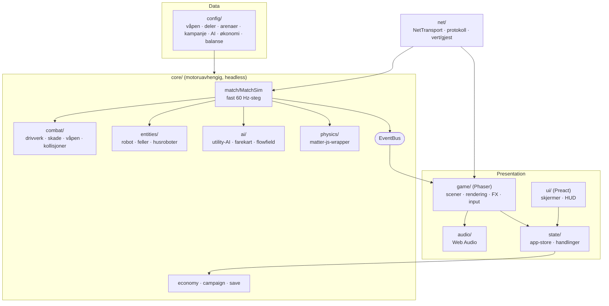
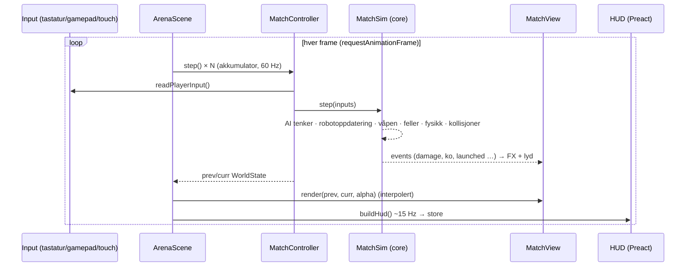

# Arkitektur

IRONCLASH ARENA er delt i **simulering** (ren spillogikk) og **presentasjon** (rendering, lyd, UI). Simuleringen kjører uten nettleser – i enhetstester, i balansesimulatoren og i online-verten.

## Lag og avhengigheter

**Regler** (håndheves av `tests/unit/architecture.test.ts` og ESLint):

- `core/` og `config/` importerer aldri fra `game/`, `ui/`, `net/`, `audio/` eller `state/`.
- Ingen sirkulære (runtime-)importer.
- Moduler holdes under ~300 linjer.

## Dataflyt i en kamp

- **Fast tidssteg:** Simuleringen går alltid i 60 Hz (`DT = 1/60`). Rendering interpolerer mellom de to siste tilstandene (`alpha = akkumulator / DT`). Hit-stop og slow motion manipulerer bare akkumulatoren lokalt.
- **Determinisme:** All tilfeldighet i simuleringen går via seedet `Rng` (mulberry32). AI-er har egne seedede RNG-er. Samme seed og input gir identisk kamp (testet).
- **Event-bus:** `damage`, `ko`, `launched`, `hazardTriggered`, `matchEnd` m.fl. Effekter, lyd, statistikk og nettverk abonnerer – simuleringen vet ikke om dem.
- **WorldState:** `captureState()` lager et rent snapshot som både renderer og nettverksprotokoll bruker. Derfor tegnes en online-gjest med nøyaktig samme kode som en lokal kamp.

## MatchController-varianter

| Kontroller        | Brukes i                                            | Simulering                                      |
| ----------------- | --------------------------------------------------- | ----------------------------------------------- |
| `LocalController` | Kampanje, hurtigkamp, lokal 2P, øving, menybakgrunn | Lokal `MatchSim`                                |
| `HostController`  | Online-vert                                         | Lokal `MatchSim`, sender snapshots 30 Hz        |
| `GuestController` | Online-gjest                                        | Ingen – prediksjon + interpolering av snapshots |

## UI ↔ Phaser

Preact-UI-et ligger som et DOM-lag over Phaser-lerretet. De deler en liten typet store (`state/store.ts`). UI-et styrer kamper via `gameBridge` (registreres av `game/createGame.ts`), så UI-koden importerer ikke Phaser. Phaser skriver HUD-data til store ~15 ganger i sekundet.

## Rendering

Alt er prosedyrisk: `game/render/paint/*` tegner roboter, arenaer, feller og partikler med Canvas 2D ved oppstart, og tegningene registreres som Phaser-teksturer. Garasjens 3D-aktige forhåndsvisning gjenbruker de samme lagene med skrå projeksjon og ekstrudering. Robotteksturer fjernes når en kamp avsluttes, slik at gjentatte kamper ikke lekker minne (testet med 20 kamper på rad).

## Lagring

`core/save` bruker Zod-skjema med `version`-felt og migreringer (`MIGRATIONS[fra-versjon]`). Korrupt lagring gir en dialog med tilbud om tilbakestilling. Innstillinger lagres separat, slik at nullstilt fremgang beholder innstillingene.
