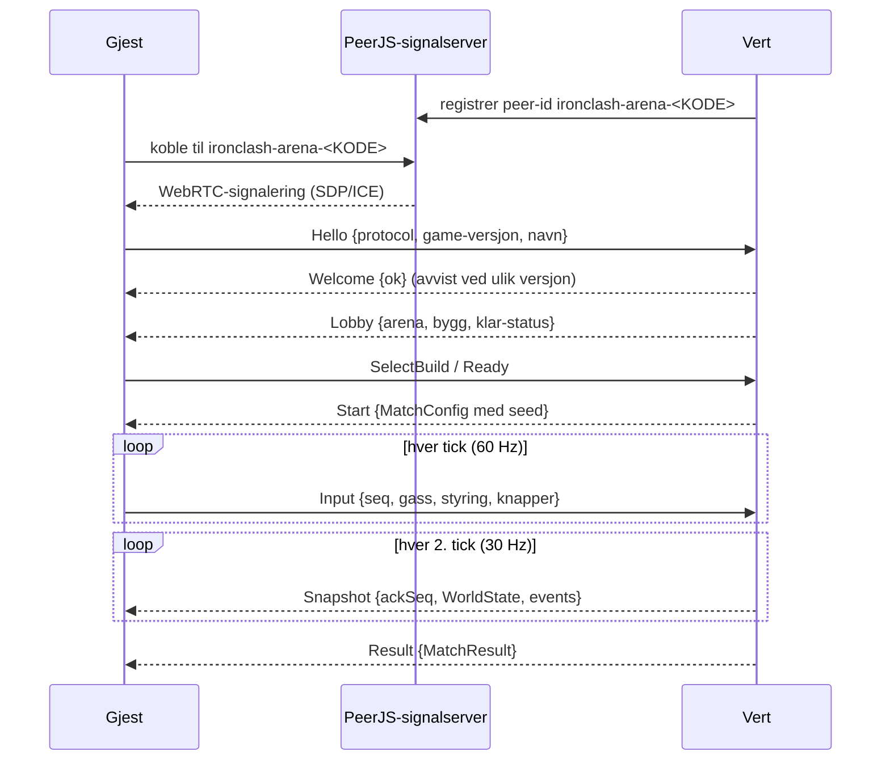

# Nettkode

Online-modusen er **vertsautoritativ peer-to-peer** over WebRTC (PeerJS). Det finnes ingen egen spillserver, så alt kan hostes statisk.

## Oversikt

- **Romkode:** 6 tegn fra et alfabet uten forvekslbare tegn (`A–Z` uten I/O, `2–9`). Lenken `?join=KODE` åpner online-skjermen og kobler til automatisk.
- **Versjonssjekk:** `PROTOCOL_VERSION` (wire-format) og spillversjonen fra `package.json` må være like, ellers avvises gjesten med en tydelig melding.
- **Transport:** `NetTransport` (`src/net/transport.ts`) abstraherer kanalen. `peerProvider` bruker PeerJS med `serialization: 'raw'` (ArrayBuffer). `loopbackProvider` brukes i tester. En autoritativ server (f.eks. Colyseus over WebSocket) kan legges til som ny `NetProvider` uten endringer i spillogikken.

## Tickrate og meldinger

| Melding       | Retning      | Frekvens | Størrelse     |
| ------------- | ------------ | -------- | ------------- |
| `Input`       | gjest → vert | 60 Hz    | 8 byte        |
| `Snapshot`    | vert → gjest | 30 Hz    | ~120–300 byte |
| `Ping`/`Pong` | begge        | 1 Hz     | 9 byte        |

Alt er binært (`ByteWriter`/`ByteReader`, little-endian). Snapshots sendes som kvantiserte tall, ikke objekter:

- posisjon: `u16` × 0,1 enhet · vinkel: `i16` (±π) · fart: `i16` × 0,1
- HP/energi: `u16` × 0,1 · rpm, helse-multiplikatorer: `u8` (0–1)
- 9 boolske flagg pakket i ett `u16`
- feller: fase (`u8`) + fremdrift (`u8`) – fellenes timing er dessuten deterministisk fra seed
- hendelser (`damage`, `ko`, `hazardTriggered` …) kodes med en felttabell per type, og enum-verdier som indekser.

`tests/unit/protocol.test.ts` verifiserer at alle meldinger går tur-retur og at et snapshot er under 400 byte.

## Prediksjon og interpolering

**Egen robot (gjest):** Hver input får et sekvensnummer og lagres. Gjesten kjører samme kinematiske drivverksmodell som verten (`stepDrive` i `core/combat/drive.ts`) og flytter roboten umiddelbart. Når et snapshot kommer med `ackSeq`, starter gjesten fra den autoritative tilstanden og spiller av alle input med høyere sekvensnummer (`reconcile`). Avviket glattes (35 % per frame), store avvik (> 90 enheter) snappes. Prediksjonen slås av når roboten er i kontakt, i luften, veltet, holdt eller løftet – da brukes vertens tilstand direkte.

**Motstander og verden:** Gjesten rendrer ~100 ms (6 tick) bak nyeste snapshot og interpolerer mellom de to snapshotene rundt render-tiden, med en myk drift-korreksjon. Hendelser spilles av når render-tiden passerer tick-en de skjedde på, slik at gnister og lyd treffer riktig bilde.

**Verten** kjører den fulle simuleringen med 60 Hz og bruker gjestens siste mottatte input. Hit-stop og slow motion er bare lokale effekter offline; online pauses aldri simuleringen.

## Frakobling

- Mister verten gjesten, fryses kampen og en nedtelling på 15 s vises. Gjesten prøver å koble til på nytt hvert 2,5 s (samme romkode). Kommer gjesten ikke tilbake, vinner verten på walkover.
- Mister gjesten verten, vises samme nedtelling. Lykkes ikke gjenoppkoblingen, vinner gjesten på walkover.
- Online-kamper kan ikke pauses; menyen kan åpnes, og «Gi opp og forlat» avslutter.

## NAT og TURN

De fleste forbindelser går direkte med STUN (Google og Twilio er satt opp). Bak symmetrisk NAT trengs en TURN-relé – se README for coturn. Konfigureres med `VITE_TURN_URL`, `VITE_TURN_USER` og `VITE_TURN_CREDENTIAL`.

## Testing lokalt

Åpne spillet i to nettleservinduer (eller to profiler), lag rom i det ene og bli med i det andre. Merk: headless Chrome skjuler lokale IP-er med mDNS; Playwright-oppsett må starte Chrome med `--disable-features=WebRtcHideLocalIpsWithMdns`.
